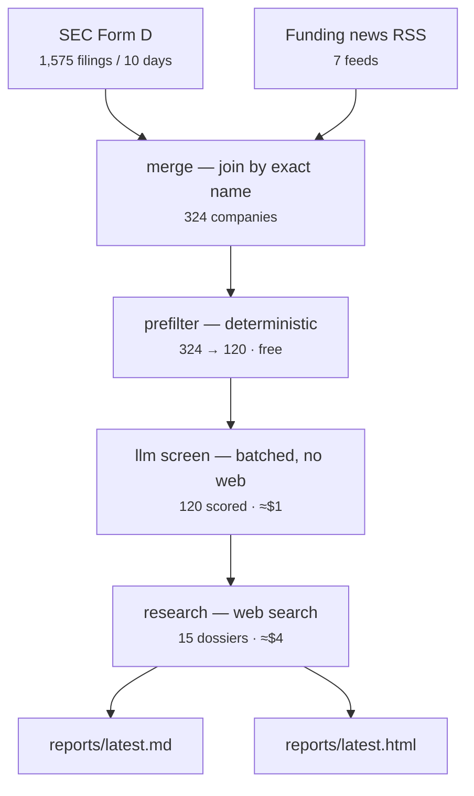

# startup-finder

A personal research assistant that finds recently-funded startups worth your time,
researches them, and writes you a digest.

It watches SEC Form D filings and funding press, filters ~1,500 filings a week
down to a handful of companies that match a profile you write, then sends Claude
to actually go read their websites and careers pages and report back.

```bash
pnpm install
pnpm sf run
```

Output lands in [`reports/latest.md`](reports/latest.md) and
[`reports/latest.html`](reports/latest.html), both committed to the repo.

---

## What it actually produces

From a real run over 10 days: 1,575 Form D filings → 316 operating companies →
329 candidates (after adding press) → 120 LLM-screened → 15 deep-researched.

The top result was a $150M Series C company, correctly identified as a YC-backed
agentic-AI company for logistics, with 13 open engineering roles listed, its
founders' backgrounds, and its investor list — none of which appears anywhere in
the SEC filing that surfaced it.

Total cost: about $4 of LLM spend and 15 minutes.

## Why it exists

SEC Form D is the only *comprehensive* record of US private funding — every
round, public within 15 days, free. It is also nearly unusable: ~80% of filers
are real-estate SPVs and investment funds, and a real company's filing gives you
a name, a dollar amount, and a coarse industry code. Nothing about what they do.

News is the opposite: rich, but only covers companies that already have PR.

So: **Form D for recall, news for context, an LLM for the judgement in between.**

See [`docs/VISION.md`](docs/VISION.md) for the longer argument.

## How it works



Five stages, each independently runnable:

| Stage | What it does | Cost |
|---|---|---|
| `ingest` | Pull SEC Form D filings + funding news RSS | free, slow |
| `merge` | Join filings and press into company records | free |
| `score` | Rank everything, then LLM-screen the top ~120 | ~$1 |
| `research` | Claude reads the web on the top ~15 | ~$3-7 |
| `report` | Write the digest and dashboard | free |

**Why a funnel.** Cost per company rises ~40x from screening to research, so each
tier has to narrow the field before the next one runs — researching all 324
companies would cost ~$100 instead of ~$4. Because stages persist to disk
independently, you can re-run `score` and `report` while tuning your profile
without re-paying for research.

**Where the judgement lives.** `config/profile.yaml` — themes and weights,
round-size window, geography, and a free-text description of you passed verbatim
to the model. It is policy; everything else is mechanism.

To read the exact prompt the screening stage sends, without spending anything:

```bash
pnpm sf prompt --limit 3
```

```bash
pnpm sf run                        # everything (the normal entry point)
pnpm sf run --days 3 --budget 2    # quick, cheap pass
pnpm sf score && pnpm sf report    # re-screen after editing your profile
pnpm sf stats                      # what's in data/
pnpm sf show oxide-computer        # everything known about one company
pnpm sf prompt                     # the exact LLM screening prompt, free
```

Run `pnpm sf --help` for all options.

## Configure it

Everything that defines "a startup worth my time" lives in one file:
[`config/profile.yaml`](config/profile.yaml). Themes and their weights, round-size
window, geography, and a free-text description of you that gets fed to the model
verbatim.

**If the results feel wrong, edit that file before you touch any code.** Then:

```bash
pnpm sf score --limit 200 && pnpm sf report
```

## Requirements

- Node 22+ and pnpm
- The [Claude Code CLI](https://claude.com/claude-code) on your PATH — the app
  shells out to `claude -p` for all LLM work, so it runs on your existing Claude
  subscription with no separate API key. See
  [ADR-003](docs/DECISIONS.md#adr-003-use-the-claude-code-cli-as-the-llm-backend).

Optionally set `SF_CONTACT` to your email; the SEC asks that automated clients
identify themselves.

## Cost control

Every run takes a hard `--budget` in dollars and refuses to start a call that
would exceed it. LLM responses are cached on disk, so re-runs are nearly free.
Lifetime spend is tracked in `data/runs.jsonl` and shown by `pnpm sf stats`.

## Repo layout

```
config/profile.yaml   what you care about — the only file most users edit
src/sources/          EDGAR and RSS ingestion
src/pipeline/         merge, prefilter, LLM scoring, research
src/report/           markdown digest + HTML dashboard
src/llm/claude.ts     the claude -p wrapper (caching, budget, retries)
data/*.jsonl          all persisted data, committed to git on purpose
reports/              generated digests, committed
docs/                 why things are the way they are — read before changing
```

## For agents and contributors

Start with [`CLAUDE.md`](CLAUDE.md), then
[`docs/ARCHITECTURE.md`](docs/ARCHITECTURE.md). The `docs/` directory explains the
reasoning behind the design, not just the mechanics — particularly
[`docs/DECISIONS.md`](docs/DECISIONS.md), which records what was tried and
rejected.

```bash
pnpm test        # 113 tests, no network required
pnpm typecheck
```

## Honest limitations

- **US-centric.** Form D is a US filing. Non-US startups only appear via press.
- **Form D says nothing about the product.** It gives a name, an amount, and a
  coarse industry code. Everything else is inferred or researched.
- **Name matching is exact-only** by design, so the same company can appear twice
  under different spellings. See [ADR-004](docs/DECISIONS.md).
- **The research stage can be wrong.** It is a model reading the web. Anything not
  backed by a link in the report should be verified before you act on it.

More detail in [`docs/DATA_SOURCES.md`](docs/DATA_SOURCES.md).
