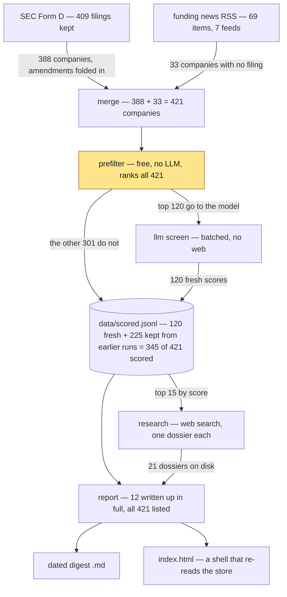

# startup-finder

Finds recently-funded startups worth your time, researches them, and writes you a
digest.

```bash
pnpm install
pnpm sf run
```

Output: a dated digest in [`reports/`](reports/) — the newest date is the current
one — plus a filterable dashboard at `index.html`. The dashboard reads the
committed data, so it has to be served rather than opened from disk:

```bash
python3 -m http.server 8000   # then open http://localhost:8000/
```

---

## What it produces

A day's filings: 222 SEC Form Ds → 47 real operating companies → screened → the
best few researched in depth. Ten minutes, a few dollars of plan usage.

The best new find that day was an AI evaluation and observability platform, with
its product, customers, and two open engineering roles — none of which appears in
the SEC filing that surfaced it.

## Why it exists

SEC Form D is the only comprehensive record of US private funding: every round,
public within 15 days, free. It is also nearly unusable — ~80% of filers are
real-estate SPVs and investment funds, and a real company's filing gives you a
name, a dollar amount, and an industry code. Nothing about what they do.

News is the opposite: rich, but only covers companies that already have PR.

So: **Form D for recall, news for context, an LLM for the judgement in between.**

## How it works



- **merge** — one record per company, joining filings and headlines on an exact
  name match. Runs forever against the same store, so the corpus accumulates.
- **prefilter** — a free scoring pass over *everything*, using only what a Form D
  gives you: how recent, how big, industry code, state, officer count, keywords in
  the name. It ranks; the top `--limit` go on. No LLM, no network.
- **llm screen** — scores each company 0–100 against your profile, eight at a time,
  **with no web access**. It sees a name, an amount, an industry code, a city and
  some officer names — nothing about the product. So it is often *not* accurate,
  and is built to admit it: it answers `"Unknown — …"` for ~60% of companies and
  returns a confidence with every score. Run `pnpm sf prompt` to see exactly what
  it gets.
- **research** — takes the top ~15 by score and actually searches the web for each:
  what they build, who founded it, open roles, links. Dossiers are cached, so a
  re-run only researches companies it has not seen (21 have accumulated on disk).
- **report** — writes up the 12 best researched companies in full, and lists every
  other candidate in a table below, so nothing disappears quietly.

Counts are the state on disk after one real run, so they close: 388 + 33 = 421
companies, 120 screened this run and 301 not, leaving 345 with a score and 76
never looked at. Scores outlive the run that made them, which is why more
companies carry one than were screened today. Separately, the 409 filings are what
survived the fund filter — about four in five Form D filers are SPVs or funds —
and one day adds roughly 220 filings.

The highlighted step is the one that loses things: only its top `--limit`
companies are ever shown to the model, and it ranks them knowing little more than
a legal name. [`docs/RANKING.md`](docs/RANKING.md) measures what that costs and
specifies the replacement.

```bash
pnpm sf run                        # everything (the normal entry point)
pnpm sf run --days 3 --research 5  # quick pass
pnpm sf score && pnpm sf report    # re-screen after editing your profile
pnpm sf stats                      # what's in data/
pnpm sf show oxide-computer        # everything known about one company
pnpm sf prompt --limit 3           # the exact screening prompt, no LLM call
pnpm sf prompt --stage research    # the research prompt, no LLM call
```

## Run it weekly

```bash
./scripts/install-schedule.sh     # Monday 08:00, via launchd
```

Each run writes a dated issue to `reports/`, commits it, and notifies you. Back
issues live in git. Pushing is off by default — this repo is public. Details in
[`docs/SCHEDULING.md`](docs/SCHEDULING.md).

## Configure it

[`config/profile.yaml`](config/profile.yaml) defines what "a startup worth my
time" means — themes and weights, round-size window, geography, and a free-text
description of you passed verbatim to the model.

**If results feel wrong, edit that file before touching any code.** Then
`pnpm sf score && pnpm sf report`.

## Requirements

Node 22+, pnpm, and the [Claude Code CLI](https://claude.com/claude-code) on your
PATH. Optionally set `SF_CONTACT` to your email — the SEC asks automated clients
to identify themselves.

## Cost

Runs on your Claude subscription. **Nothing is billed to a card.** A full run
uses roughly $4-equivalent of tokens, reported at the end of the run and kept in
`data/runs.jsonl`. Responses are cached, so re-runs cost almost nothing.

There is no spend cap — a run uses what the work needs. `--limit` (companies
screened) and `--research` (dossiers written) are the knobs that make a run
cheaper.

## Repo layout

```
config/profile.yaml   what you care about — the only file most users edit
src/sources/          EDGAR and RSS ingestion
src/pipeline/         merge, prefilter, LLM scoring, research
src/report/           markdown digest + HTML dashboard
src/llm/claude.ts     the claude -p wrapper (caching, cost accounting, retries)
data/*.jsonl          all persisted data, committed to git on purpose
reports/              generated digests + dashboard metadata, committed
index.html            the dashboard shell; reads data/, so it must be served
docs/                 why things are the way they are — read before changing
```

## For agents and contributors

Start with [`CLAUDE.md`](CLAUDE.md), then
[`docs/ARCHITECTURE.md`](docs/ARCHITECTURE.md).
[`docs/DECISIONS.md`](docs/DECISIONS.md) records what was tried and rejected, and
[`docs/RANKING.md`](docs/RANKING.md) is the measured redesign of how candidates
are filtered and ordered — read it before touching either.

```bash
pnpm test        # 172 tests, no network required
pnpm typecheck
```

## Limitations

- **Lookback auto-catches-up, up to 90 days.** Omit `--days` and the window
  widens to cover everything since your last run. Gaps longer than 90 days are
  capped, and the run tells you exactly how many days it skipped and what to run
  to backfill them. News feeds cannot be backfilled at all — RSS only carries
  recent items.
- **US-centric.** Form D is a US filing; non-US startups appear only via press.
- **Name matching is exact-only** by design, so one company can appear twice under
  different spellings ([ADR-004](docs/DECISIONS.md)).
- **Research can be wrong.** It is a model reading the web. Anything not backed by
  a link in the report should be verified before you act on it.

**[`docs/READING_THE_REPORT.md`](docs/READING_THE_REPORT.md) is the one to read
before acting on a digest** — what a score actually means, where every ranking
signal comes from, and what never reaches you. More on coverage in
[`docs/DATA_SOURCES.md`](docs/DATA_SOURCES.md).
