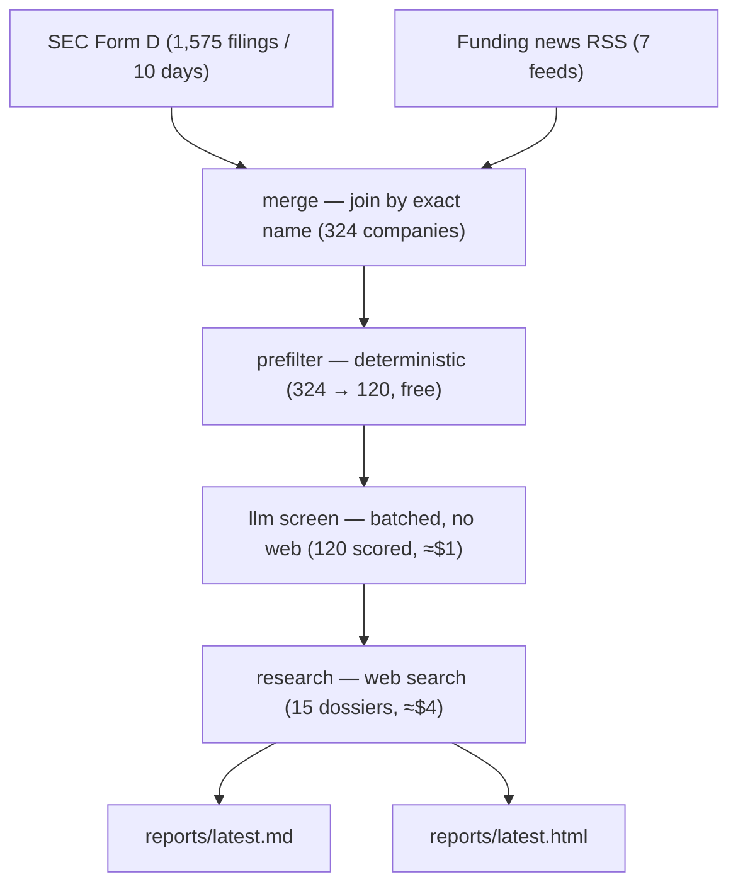

# startup-finder

Finds recently-funded startups worth your time, researches them, and writes you a
digest.

```bash
pnpm install
pnpm sf run
```

Output: [`reports/latest.md`](reports/latest.md) and
[`reports/latest.html`](reports/latest.html), both committed to the repo.

---

## What it produces

A real 10-day run: 1,575 SEC filings → 316 operating companies → 324 candidates
with press → 120 LLM-screened → 15 researched in depth. About 15 minutes.

The top result was a $150M Series C company, identified as YC-backed agentic AI
for logistics, with 13 open engineering roles, founder backgrounds, and its
investor list — none of which appears in the SEC filing that surfaced it.

## Why it exists

SEC Form D is the only comprehensive record of US private funding: every round,
public within 15 days, free. It is also nearly unusable — ~80% of filers are
real-estate SPVs and investment funds, and a real company's filing gives you a
name, a dollar amount, and an industry code. Nothing about what they do.

News is the opposite: rich, but only covers companies that already have PR.

So: **Form D for recall, news for context, an LLM for the judgement in between.**

## How it works



Each stage runs independently against on-disk data, so you can re-screen and
re-report without re-running the expensive research.

```bash
pnpm sf run                        # everything (the normal entry point)
pnpm sf run --days 3 --budget 2    # quick pass
pnpm sf score && pnpm sf report    # re-screen after editing your profile
pnpm sf stats                      # what's in data/
pnpm sf show oxide-computer        # everything known about one company
pnpm sf prompt --limit 3           # the exact screening prompt, no LLM call
pnpm sf prompt --stage research    # the research prompt, no LLM call
```

## Run it weekly

```bash
./scripts/install-schedule.sh     # Monday 08:00, via launchd
```

Each run writes a dated issue to `reports/`, commits it, and notifies you. Back
issues live in git. Pushing is off by default — this repo is public. Details in
[`docs/SCHEDULING.md`](docs/SCHEDULING.md).

## Configure it

[`config/profile.yaml`](config/profile.yaml) defines what "a startup worth my
time" means — themes and weights, round-size window, geography, and a free-text
description of you passed verbatim to the model.

**If results feel wrong, edit that file before touching any code.** Then
`pnpm sf score && pnpm sf report`.

## Requirements

Node 22+, pnpm, and the [Claude Code CLI](https://claude.com/claude-code) on your
PATH. Optionally set `SF_CONTACT` to your email — the SEC asks automated clients
to identify themselves.

## Cost

Runs on your Claude subscription. **Nothing is billed to a card.** A full run
uses roughly $4-equivalent of tokens; `--budget` caps it, and responses are
cached so re-runs cost almost nothing.

## Repo layout

```
config/profile.yaml   what you care about — the only file most users edit
src/sources/          EDGAR and RSS ingestion
src/pipeline/         merge, prefilter, LLM scoring, research
src/report/           markdown digest + HTML dashboard
src/llm/claude.ts     the claude -p wrapper (caching, budget, retries)
data/*.jsonl          all persisted data, committed to git on purpose
reports/              generated digests, committed
docs/                 why things are the way they are — read before changing
```

## For agents and contributors

Start with [`CLAUDE.md`](CLAUDE.md), then
[`docs/ARCHITECTURE.md`](docs/ARCHITECTURE.md).
[`docs/DECISIONS.md`](docs/DECISIONS.md) records what was tried and rejected.

```bash
pnpm test        # 198 tests, no network required
pnpm typecheck
```

## Limitations

- **Lookback auto-catches-up, up to 90 days.** Omit `--days` and the window
  widens to cover everything since your last run. Gaps longer than 90 days are
  capped, and the run tells you exactly how many days it skipped and what to run
  to backfill them. News feeds cannot be backfilled at all — RSS only carries
  recent items.
- **US-centric.** Form D is a US filing; non-US startups appear only via press.
- **Name matching is exact-only** by design, so one company can appear twice under
  different spellings ([ADR-004](docs/DECISIONS.md)).
- **Research can be wrong.** It is a model reading the web. Anything not backed by
  a link in the report should be verified before you act on it.

**[`docs/READING_THE_REPORT.md`](docs/READING_THE_REPORT.md) is the one to read
before acting on a digest** — what a score actually means, where every ranking
signal comes from, and what never reaches you. More on coverage in
[`docs/DATA_SOURCES.md`](docs/DATA_SOURCES.md).
