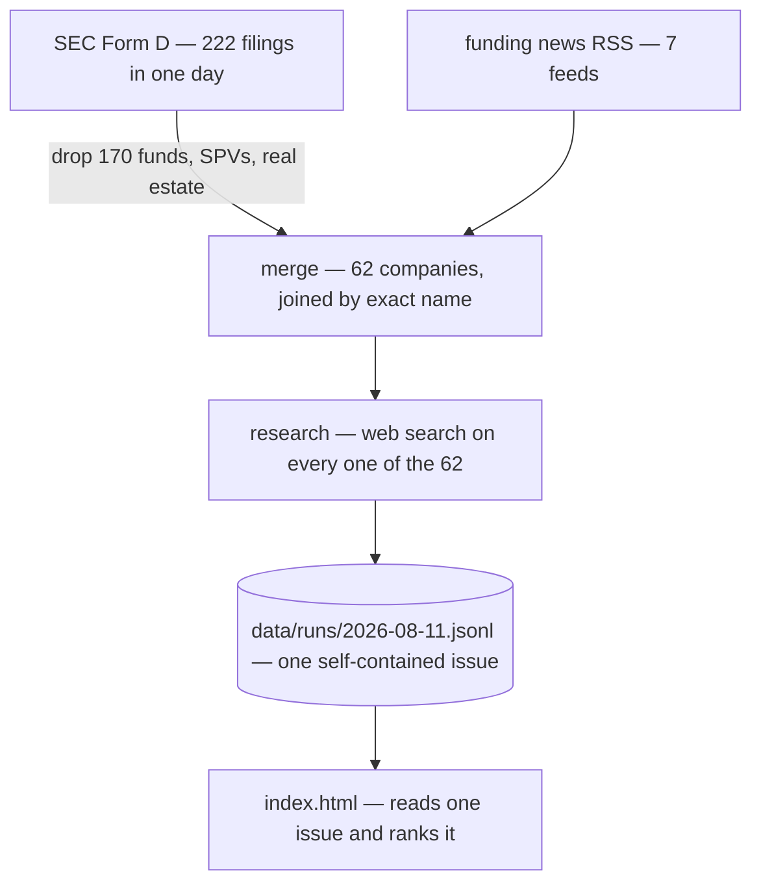

# startup-finder

Finds recently-funded startups worth your time, researches every one of them, and
scores them against what you care about.

```bash
pnpm install
pnpm sf run
```

There are exactly **two** things to run, ever:

| I want to… | Do this |
|---|---|
| Get a new issue, every day | A **Claude Desktop Routine** running `pnpm sf run` — [set up below](#run-it-daily) |
| Read and grade an issue | The **`review-startups` skill** — say "review startups" to Claude |

Everything else (`ingest`, `research`, `report`) is an internal stage you can
call by hand while developing, but never need to.

---

## What it produces

One day: **222 SEC Form D filings → 62 companies → all 62 researched on the web
and scored**. About 15 minutes and a few dollars of your Claude plan's usage.

Each run is a self-contained issue. The dashboard shows one issue at a time, with
a picker to move between days.

## Why it exists

SEC Form D is the only comprehensive record of US private funding: every round,
public within 15 days, free. It is also nearly unusable — about four in five
filers are funds and real-estate vehicles, and a real company's filing gives you a
name, a dollar amount, and an industry code. Nothing about what they do.

News is the opposite: rich, but only covers companies that already have PR.

So: **Form D for coverage, news for context, and a model that actually reads the
web for the judgement in between.**

## How it works



- **ingest** — pulls one day of Form D filings and funding headlines. A filter
  drops funds, SPVs and real-estate vehicles, which are most of what gets filed.
- **merge** — one record per company, joining a filing and a headline when the
  names match exactly.
- **research** — the only LLM stage, and the whole point. It searches the web for
  **every** company: what they build, who founded it, open roles, links — and
  scores the fit while it is there. Nothing is filtered out before this, so a
  company is never dismissed on the basis of its name.
- **dashboard** — `index.html` loads one issue and ranks it. Every company in the
  run is shown; there is no top-N cut.

## Configure it

[`config/profile.yaml`](config/profile.yaml) defines what "worth my time" means —
themes and weights, round-size window, geography, and a free-text description of
you that is passed to the model verbatim.

It also records **where you live** — companies headquartered elsewhere score
lower, since relocation or a permanent time-zone gap is a real cost.

**If results feel wrong, edit that file first.** Then sample the effect on an
existing issue for about a dollar, before re-scoring everything:

```bash
pnpm sf research --refresh --limit 5
```

## Run it daily

The daily workflow is a **Claude Desktop Routine**. Create one that runs on your
schedule with a prompt like:

```
In ~/git/startup-finder, run `pnpm sf run`.
Then tell me the top 3 companies it found and what they do.
```

That is the whole setup. The prompt stays that short because `pnpm sf run`
decides everything for itself:

- **It researches until your usage window runs out, then stops cleanly** and
  says what is left. That is the intended stopping point, not a failure: a day's
  filings are worth roughly one Claude Pro window, so the limit is the natural
  unit of work and needs no tuning.
- **A missed day is backfilled** without you asking, and an issue that a rate
  limit interrupted is resumed. Both are the same thing to it — a day with
  companies still unresearched — so there is no separate recovery step.
- **A run with nothing outstanding makes no LLM calls at all**, so it is free.
- It is **idempotent**. Running it twice costs nothing the second time.

### Getting through a backlog faster

Five-hour windows reset on their own, so **schedule two or three routines more
than five hours apart** — 07:00, 13:00, 19:00. Each continues where the last
stopped; on an ordinary day the first finishes everything and the rest exit free.

Weekly and monthly caps do not reopen in hours, so check the log for which limit
stopped a run before adding more routines.

To leave window in reserve: `pnpm sf run --limit 30`.

Days older than a week are dropped, newest first.

If you would rather not use Routines, any scheduler works — it is one command
with no arguments. `launchd`, `cron`, or running it by hand are all equivalent.

## Read and grade an issue

Say **"review startups"** to Claude and the `review-startups` skill takes it from
there: it serves the repo, opens the dashboard, and — when you are done — folds
your grades into `data/labels.jsonl` and commits them.

Grading is mostly passive. Scrolling a company up past the middle of the screen
records it as *ignored*, expanding **Details** records it as *opened*, and the
only clicks are ★ save and the **not interested** button inside Details.

Those grades are the only ground truth the app has: the model can tell you what a
company does, but not whether its taste matches yours.

## Inspecting things by hand

Not workflows — diagnostics, for when something looks wrong:

```bash
pnpm sf runs                       # what is on disk, and what it cost
pnpm sf show <company-id>          # everything known about one company
pnpm sf prompt                     # the exact research prompt, no LLM call
```

## Cost

Runs on your Claude subscription. **Nothing is billed to a card.** Researching one
company measured at **~$0.25-0.30-equivalent**, so a 60-company day is **~$15-18**.
That is the price of scoring everything rather than guessing from names.

**A full day can exhaust a Claude Pro 5-hour window.** Measured: 20 companies
researched over seven minutes, then every remaining call refused. The run detects
that, stops cleanly rather than marking the rest as failures, and says how many it
missed. Tomorrow's routine picks them up — there is nothing to do by hand.

That is now the intended stopping point rather than a problem: a run researches
until the window is spent and leaves the rest for next time. Schedule a second
routine more than five hours later if you want more done in a day, or pass
`--limit` to keep some window in reserve.

## Requirements

Node 22+, pnpm, and the [Claude Code CLI](https://claude.com/claude-code) on your
PATH. Optionally set `SF_CONTACT` to your email — the SEC asks automated clients to
identify themselves.

## Repo layout

```
config/profile.yaml     what you care about — the only file most users edit
src/sources/            EDGAR and RSS ingestion
src/pipeline/           merge, then research-and-score
src/report/html.ts      the dashboard shell
src/llm/claude.ts       the claude -p wrapper (caching, cost accounting, retries)
data/runs/<date>.jsonl  one self-contained issue per run, committed
data/index.json         the list of issues
index.html              the dashboard; reads data/, so it must be served
docs/                   how it works, and where the data comes from
```

## Limitations

- **The ingest filter is the only thing that drops a company.** It is a heuristic
  over the filer's own industry code and entity type. Measured against a model
  re-judging everything it dropped on a real day, its recall was **97.9%** — the
  one miss was an operating company structured as an LP, which is now handled.
- **US-centric.** Form D is a US filing; non-US startups appear only via press.
- **Name matching is exact-only** by design, so one company can appear twice under
  different spellings. A wrong merge is far worse than a duplicate.
- **Research can be wrong.** It is a model reading the web. Anything not backed by
  a link in the dashboard should be verified before you act on it. The model is
  asked to say "Unknown" rather than guess, and to flag entities that turn out not
  to be real operating companies.

## For agents and contributors

Start with [`CLAUDE.md`](CLAUDE.md), then
[`docs/ARCHITECTURE.md`](docs/ARCHITECTURE.md) and
[`docs/DATA_SOURCES.md`](docs/DATA_SOURCES.md).

```bash
pnpm test        # 147 tests, no network required
pnpm typecheck
```
