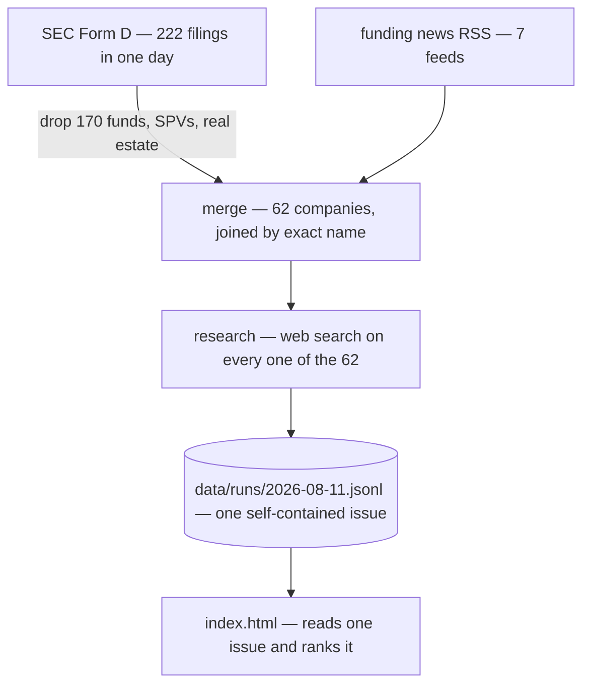

# startup-finder

Finds recently-funded startups worth your time, researches every one of them, and
scores them against what you care about.

```bash
pnpm install
pnpm sf run
```

Then serve the repo root and open it — the dashboard reads data from disk, so it
needs a server rather than a `file://` open:

```bash
python3 -m http.server 8000   # then http://localhost:8000/
```

---

## What it produces

One day: **222 SEC Form D filings → 62 companies → all 62 researched on the web
and scored**. About 15 minutes and a few dollars of your Claude plan's usage.

Each run is a self-contained issue. The dashboard shows one issue at a time, with
a picker to move between days.

## Why it exists

SEC Form D is the only comprehensive record of US private funding: every round,
public within 15 days, free. It is also nearly unusable — about four in five
filers are funds and real-estate vehicles, and a real company's filing gives you a
name, a dollar amount, and an industry code. Nothing about what they do.

News is the opposite: rich, but only covers companies that already have PR.

So: **Form D for coverage, news for context, and a model that actually reads the
web for the judgement in between.**

## How it works



- **ingest** — pulls one day of Form D filings and funding headlines. A filter
  drops funds, SPVs and real-estate vehicles, which are most of what gets filed.
- **merge** — one record per company, joining a filing and a headline when the
  names match exactly.
- **research** — the only LLM stage, and the whole point. It searches the web for
  **every** company: what they build, who founded it, open roles, links — and
  scores the fit while it is there. Nothing is filtered out before this, so a
  company is never dismissed on the basis of its name.
- **dashboard** — `index.html` loads one issue and ranks it. Every company in the
  run is shown; there is no top-N cut.

## Configure it

[`config/profile.yaml`](config/profile.yaml) defines what "worth my time" means —
themes and weights, round-size window, geography, and a free-text description of
you that is passed to the model verbatim.

**If results feel wrong, edit that file first.** Then `pnpm sf research --limit 5`
on an existing run to see the effect cheaply.

## Commands

```bash
pnpm sf run                        # one day, end to end
pnpm sf run --limit 5              # a cheap trial
pnpm sf ingest                     # fetch a day, no LLM
pnpm sf research --date 2026-08-11 # research that issue
pnpm sf runs                       # what is on disk, and what it cost
pnpm sf show <company-id>          # everything known about one company
pnpm sf prompt                     # the exact research prompt, no LLM call
```

## Cost

Runs on your Claude subscription. **Nothing is billed to a card.** Researching one
company measured at **~$0.23-equivalent**, so a 60-company day is **~$14**. That
is the price of scoring everything rather than guessing from names.

There is no spend cap. `--limit` caps how many companies a run researches, as a
safety valve for an unusually heavy day. Responses are cached, so re-running a day
costs nothing.

## Requirements

Node 22+, pnpm, and the [Claude Code CLI](https://claude.com/claude-code) on your
PATH. Optionally set `SF_CONTACT` to your email — the SEC asks automated clients to
identify themselves.

## Repo layout

```
config/profile.yaml     what you care about — the only file most users edit
src/sources/            EDGAR and RSS ingestion
src/pipeline/           merge, then research-and-score
src/report/html.ts      the dashboard shell
src/llm/claude.ts       the claude -p wrapper (caching, cost accounting, retries)
data/runs/<date>.jsonl  one self-contained issue per run, committed
data/index.json         the list of issues
index.html              the dashboard; reads data/, so it must be served
docs/                   how it works, and where the data comes from
```

## Limitations

- **The ingest filter is the only thing that drops a company.** It is a heuristic
  over the filer's own industry code and entity type. Measured against a model
  re-judging everything it dropped on a real day, its recall was **97.9%** — the
  one miss was an operating company structured as an LP, which is now handled.
- **US-centric.** Form D is a US filing; non-US startups appear only via press.
- **Name matching is exact-only** by design, so one company can appear twice under
  different spellings. A wrong merge is far worse than a duplicate.
- **Research can be wrong.** It is a model reading the web. Anything not backed by
  a link in the dashboard should be verified before you act on it. The model is
  asked to say "Unknown" rather than guess, and to flag entities that turn out not
  to be real operating companies.

## For agents and contributors

Start with [`CLAUDE.md`](CLAUDE.md), then
[`docs/ARCHITECTURE.md`](docs/ARCHITECTURE.md) and
[`docs/DATA_SOURCES.md`](docs/DATA_SOURCES.md).

```bash
pnpm test        # 146 tests, no network required
pnpm typecheck
```
