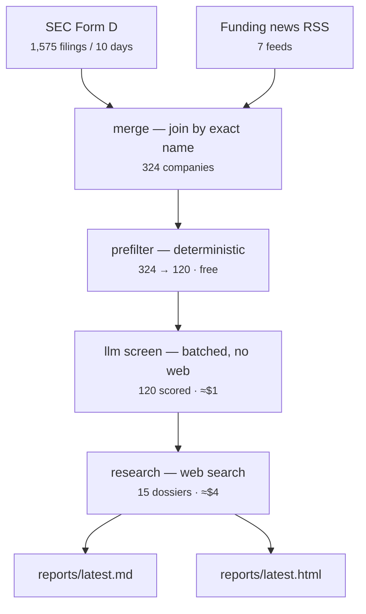

# How it works

_The short version. See [VISION.md](VISION.md) for why, [ARCHITECTURE.md](ARCHITECTURE.md) for detail._

## The problem

SEC Form D is the only *comprehensive* record of US private funding — every round,
public within 15 days, free. It is also nearly unusable: ~80% of filers are
real-estate SPVs and investment funds, and a real company's filing gives you a
name, a dollar amount, and a coarse industry code. Nothing about what they do.

News is the opposite: rich, but only covers companies that already have PR.

So: **Form D for recall, news for context, an LLM for the judgement in between.**

## The pipeline

## Why a funnel

Cost per company rises ~40x from screening to research. Each tier has to narrow
the field before the next one runs — researching all 324 companies would cost
~$100 instead of ~$4. Stages run independently, so you can re-score after editing
your profile without re-paying for research.

## Where the judgement lives

`config/profile.yaml`. Themes and weights, round-size window, geography, and a
free-text description of you passed verbatim to the model. **If results look
wrong, edit that file first** — it is policy; everything else is mechanism.

## What you get

A ranked digest with a five-minute "at a glance" table, full dossiers for the top
companies (product, team, open roles, red and green flags, links), and every
lower-ranked company still listed so nothing disappears silently.
